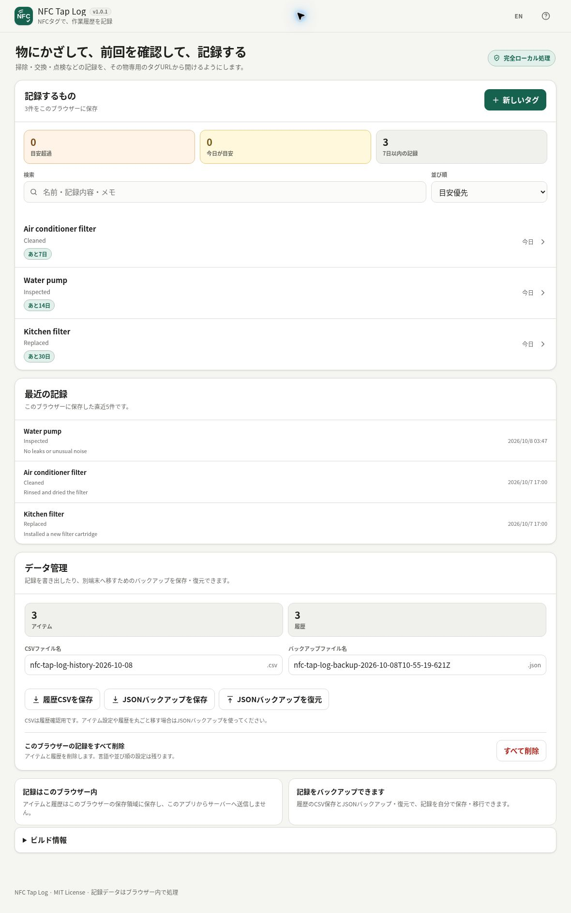

# NFC Tap Log

[](https://github.com/ttomohisa/htmlapps-nfc-tap-log/actions/workflows/deploy-pages.yml)
[](LICENSE)
[](https://ttomohisa.github.io/htmlapps-nfc-tap-log/)

[English README](README.md)

NFC Tap Log は、物に貼ったNFCタグやQRコードを入口にして、「最後にいつ掃除・交換・点検などをしたか」を確認し、次の作業をブラウザー内へ記録するツールです。

## 🚀 Live demo

### [GitHub PagesでNFC Tap Logを開く](https://ttomohisa.github.io/htmlapps-nfc-tap-log/)

GitHub Pagesから最初のHTMLを取得します。アイテム、メモ、履歴、QR生成、バックアップ・復元、対応環境でのWeb NFC操作はブラウザー内で処理します。記録データをこのアプリからサーバーへアップロードしません。

[](https://ttomohisa.github.io/htmlapps-nfc-tap-log/)

## Features

- **物理タグをその物専用の入口にする** — 1タグ = 1アイテム = 1アクションのシンプルな構成です。
- **前回を確認してから記録する** — 前回日時、経過日数、記録回数、任意の目安時期を確認できます。
- **明示的に記録する** — タグやQRを開いただけでは履歴を追加せず、実際の作業後に記録ボタンを押します。
- **対応AndroidブラウザーでNFCを書き込み・確認** — Portable Tag URLをNDEF URLレコードとして書き込み、ID・名前・記録内容・目安まで読み返して照合できます。
- **QRをフォールバックに使う** — NFCと同じPortable Tag URLのQRを生成し、PNG保存やラベル印刷ができます。
- **NFCなしでも管理できる** — 検索、並び替え、履歴編集、メモ、Undo、アイテム編集をホームから利用できます。
- **自分でバックアップできる** — 履歴CSV保存と、アイテム設定・履歴を含むJSON完全バックアップ・復元に対応します。
- **日本語 / 英語UI** — 同じHTMLに両言語を内包しています。
- **実行時CDN・クラウド保存なし** — 配布HTMLは `connect-src 'none'` を維持し、QR生成コードも内包します。

## Quick start

### Web版を使う

[GitHub Pages版](https://ttomohisa.github.io/htmlapps-nfc-tap-log/)を開くだけで使えます。登録やインストールは不要です。

### 単一HTMLを使う

1. このリポジトリまたはリリースZIPから `dist/index.html` を保存します。
2. 現行ブラウザーで開きます。
3. ローカル記録、履歴、QR生成、CSV保存、JSONバックアップ・復元を利用できます。

NFCの直接読み書きだけは条件が異なります。Web NFCは対応ブラウザーと安全なトップレベルページを必要とするため、NFC操作には公開HTTPS版を使用してください。

## 使い方

1. **新しいタグ**を開きます。
2. `エアコンフィルター`、`掃除した` のように名前と記録内容を入力します。
3. 必要なら目安日数と、この端末だけに残すメモを設定します。
4. アイテムを作成します。
5. 対応Androidブラウザーでは **NFCタグへ書き込む** を選び、上書き注意を確認してタグへスマートフォンを近づけます。
6. 必要なら **読み取って確認** で、書き込んだタグが現在のアイテムと一致するか確認します。
7. NFCを使えない端末向けにQRコードを保存またはラベル印刷できます。
8. 以降はNFCタグ、QRコード、またはホーム一覧からアイテムを開きます。
9. 実際の作業が終わったら記録ボタンを押します。スマートフォンでは主要な記録ボタンを画面下部にも表示します。

NFCタグやQRコードを開いただけでは作業履歴は追加されません。

## NFCと端末ごとの動作

アプリ内のNFC読み書きは、次の条件を満たす場合だけ有効になります。

- ブラウザーが `NDEFReader` に対応している
- HTTPSなど安全な接続で開いている
- iframeではなくページを直接開いている
- 端末でNFCを利用できる

直接のWeb NFC操作は対応Androidブラウザーを主対象とします。iPhone Safariでは、このアプリが利用するWeb NFC APIを使えません。あらかじめURLを書き込んだNFCタグをiOSから開くことや、QRコードから同じ画面を開くことはできます。

保存した `file://` の単一HTMLではNFCの直接読み書きはできませんが、それ以外のローカル記録機能は利用できます。

## ホーム / アイテム管理

ホームはNFCを読まなくても利用できます。目安状態、最近の記録、検索、並び替えを表示します。

初期の **目安優先** では、目安超過、今日が目安、次の目安が近いものを先に表示します。検索対象は名前、記録内容、この端末のメモです。

同じアイテムIDを持つPortable Tag URLでも、タグ側の内容がこのブラウザーで編集済みの内容より古い場合はブラウザー側を優先します。古いタグ情報でローカル履歴やメモを上書きしません。

## バックアップ / 復元

**履歴CSV** は表計算ソフトなどで履歴を確認するための出力です。UTF-8 BOM付きで保存し、復元形式には使用しません。

**JSONバックアップ** は未記録アイテムを含むアイテム設定と全履歴を保存します。復元方法は2種類です。

- **追加する** — 現在のデータを残し、まだ存在しないIDだけを追加します。
- **置き換える** — 確認後、現在のアイテムと履歴を削除してバックアップ内容へ置き換えます。

データベースを書き換える前に、アプリ種別、バックアップ形式、ID、日時、文字数、重複ID、履歴とアイテムの対応関係を検証します。

## GitHub Pagesで公開する

リポジトリには生成済み単一HTMLを公開するGitHub Actionsワークフローを含みます。

1. `htmlapps-nfc-tap-log` としてGitHubへpushします。
2. **Settings → Pages → Build and deployment → Source** で **GitHub Actions** を選びます。
3. `main` へpushするか、ActionsからPagesワークフローを手動実行します。
4. 公開後は `https://ttomohisa.github.io/htmlapps-nfc-tap-log/` で利用できます。

## Development and build layout

```text
.
├─ src/index.template.html       # アプリ本体テンプレート
├─ app.config.json               # アプリ情報・ビルド設定
├─ dependencies.json             # 依存宣言
├─ dependencies.lock.json        # 依存ロック
├─ build-standalone.bat          # Windowsビルド入口
├─ build-standalone.ps1          # 単一HTMLビルダー
├─ dist/index.html               # readable単一HTML
└─ dist/index.self-extract.html  # 圧縮self-extract版
```

Windowsでビルド:

```powershell
.\build-standalone.bat
```

リポジトリ確認:

```powershell
.\scripts\check-repository.ps1
```

## Privacy / 完全ローカル処理

記録データはブラウザー内で処理・保存します。

- アイテム名、記録内容、ローカルメモ、履歴はブラウザー内に保存します。
- NFC読み書きは端末のNFC機能を利用し、タグ内容や履歴をこのアプリからサーバーへアップロードしません。
- QR生成は外部QRサービスを使わずブラウザー内で行います。
- JSONバックアップの読み込み・検証もブラウザー内で行います。
- 生成HTMLは `connect-src 'none'` のContent Security Policyを維持します。
- analytics / telemetry は含みません。

Portable Tag URL自体は秘密情報ではありません。パスワードや機密情報を名前・記録内容へ入力しないでください。

ブラウザーのサイトデータを削除すると履歴が失われる場合があります。大切な記録はJSONバックアップを保存してください。

## Limitations

- NFCの直接読み書きはWeb NFC対応状況に依存し、主に対応Androidブラウザー向けです。
- iPhone Safariでは、このアプリ内からのNFCスキャン・書き込みはできません。
- `file://` の保存HTMLからはWeb NFCへ直接アクセスできません。NFC操作は公開HTTPS版を使ってください。
- 履歴はブラウザー / 端末ごとに保存され、自動同期しません。
- 改ざん防止や監査証跡を目的としたシステムではありません。
- 現在は1タグにつき1アイテム・1アクションです。
- NFCタグ容量には差があります。長い名前や記録内容では小容量タグへ書き込めない場合があります。
- サイトデータ削除、ブラウザー削除、端末初期化などで、バックアップしていない履歴を失う可能性があります。

## Dependencies

実行時の外部ネットワーク依存はありません。QR生成コードは単一HTMLへ内包しています。ライセンス詳細は [THIRD_PARTY_NOTICES.md](THIRD_PARTY_NOTICES.md) を参照してください。

## Contributing

不具合報告・機能提案はGitHub Issuesで受け付けます。開発時は [CONTRIBUTING.md](CONTRIBUTING.md) を参照してください。

## License

Copyright © 2026 ttomohisa

[MIT License](LICENSE) のもとで公開します。

## v1.0.1 保存・復元の改善

- CSV・JSONバックアップ・QR画像は保存前にファイル名を変更できます。拡張子を表示し、自動調整します。安全でないファイル名の文字は除去または置換します。
- CSVで数式として解釈される文字列には先頭にアポストロフィを付けます。元の記録とJSONバックアップは変更しません。
- 別のバックアップを選択したり復元をキャンセルした場合は、古いファイルの読み込み結果を無視します。復元ボタンの連打による重複処理を防ぎます。
- 日本語画面はEN、英語画面はJAを表示し、言語切り替えの説明も翻訳します。

開発基盤はhtmlapps-template `cb908779`へ追従しました。`scripts/check-repository.ps1`は外部パッケージ不要のNode回帰テストと両HTMLのビルドを行い、リポジトリ直下に同じ内容の`nfc-tap-log.html`を生成します。チェックにはNode 24とPowerShellを使います。Cloudflare PRプレビューと削除は既存のリポジトリシークレットを利用し、未設定時は理由を示してスキップします。この変更ではBrowser Kittyカタログへ公開しません。

手動記録・バックアップ・CSV・QRの確認はNFC機器なしで行えます。実際のNFC読み書きと端末での検証はクラウド確認の対象外です。
