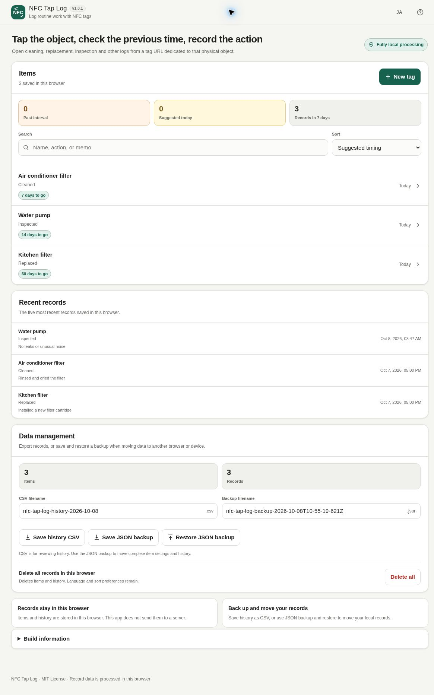

# NFC Tap Log

[](https://github.com/ttomohisa/htmlapps-nfc-tap-log/actions/workflows/deploy-pages.yml)
[](LICENSE)
[](https://ttomohisa.github.io/htmlapps-nfc-tap-log/)

[日本語版 README](README.ja.md)

NFC Tap Log turns an NFC tag or QR code attached to a physical object into a shortcut for checking the previous maintenance/routine date and recording the next action locally in the browser.

## 🚀 Live demo

### [Open NFC Tap Log on GitHub Pages](https://ttomohisa.github.io/htmlapps-nfc-tap-log/)

GitHub Pages delivers the initial HTML. Item data, notes, history, QR generation, backup/restore, and supported Web NFC operations are handled locally in the browser. The app does not upload your records to a server.

[](https://ttomohisa.github.io/htmlapps-nfc-tap-log/)

## Features

- **Use a physical tag as the entry point** — One item + one action per NFC tag keeps the flow simple.
- **Check the previous record before doing the task** — See the last date, elapsed days, record count, and optional suggested interval.
- **Record explicitly** — Opening a tag never creates a log automatically; the user presses the record button after the real task is done.
- **Write and verify NFC tags on supported Android browsers** — Write the Portable Tag URL as an NDEF URL record, then read it back and compare the item ID, name, action, and interval.
- **Use QR as a fallback** — Generate, save, or print a QR code containing the same Portable Tag URL.
- **Manage records locally** — Search, sort, edit history, add notes, delete with Undo, and edit items without requiring NFC.
- **Back up and move data yourself** — Export history as CSV and save/restore a complete JSON backup.
- **Japanese / English UI** — Both languages are included in the same HTML.
- **No runtime CDN or cloud storage** — The distributed app keeps `connect-src 'none'` and includes the QR implementation locally.

## Quick start

### Use the web demo

Open the [GitHub Pages demo](https://ttomohisa.github.io/htmlapps-nfc-tap-log/). No account or installation is required.

### Use the single HTML file

1. Download `dist/index.html` from this repository or from a release package.
2. Open the file in a current browser.
3. Local logging, history, QR generation, CSV export, and JSON backup/restore work from the saved file.

Direct NFC reading/writing is different: Web NFC requires a supported browser and a secure top-level page, so use the published HTTPS version for those actions.

## Usage

1. Select **New tag**.
2. Enter an item name such as `Air conditioner filter` and an action such as `Cleaned`.
3. Optionally set a suggested interval and a local-only memo.
4. Create the item.
5. On a supported Android browser, select **Write to NFC tag**, review the overwrite notice, and hold the phone near the tag until writing completes.
6. Optionally select **Read back & verify** to confirm the written tag still matches the current item.
7. Save or print the QR code when you want a fallback entry point.
8. Later, tap the prepared NFC URL tag, scan the QR code, or open the item from Home.
9. After doing the real task, press the record button. On mobile, the main record action is also kept at the bottom of the screen for easier reach.

Opening an NFC tag or QR code never records the task automatically.

## NFC and platform behavior

Direct Web NFC is enabled only when all of the following are true:

- The browser exposes `NDEFReader`.
- The page is opened in a secure context such as HTTPS.
- The page is the top-level page, not an iframe.
- NFC is available and enabled on the device.

The direct in-page NFC flow targets compatible Android browsers. iPhone Safari does not expose the Web NFC API used by this app. A prepared NFC URL tag can still open the item page through iOS, and QR works as another entry point.

A saved `file://` copy intentionally keeps the local logging features but cannot directly read or write NFC tags.

## Home and item management

Home works without NFC. It shows suggested timing, recent records, search, and sorting.

The default **Suggested timing** sort places past-interval items first, followed by items suggested for today and then upcoming items. Search matches the item name, action label, and local memo.

If a Portable Tag URL uses an existing item ID but contains older item details than the copy edited in this browser, the browser-local item wins. NFC Tap Log does not silently overwrite local history or memos with stale tag data.

## Backup and restore

**History CSV** is a flat export for spreadsheets or reporting. It is saved as UTF-8 with a BOM and is not a restore format.

**JSON backup** contains complete item settings and event history, including items that have no records yet. Restore provides two modes:

- **Add to current data** — Keep current data and add only IDs that are not already present.
- **Replace current data** — Delete current items/history and replace them with the selected backup after confirmation.

Before any database write, the app validates the app identity, backup format, IDs, dates, string limits, duplicate IDs, and event-to-item references.

## Publish with GitHub Pages

The repository includes a workflow for publishing the generated standalone HTML.

1. Push the repository to GitHub as `htmlapps-nfc-tap-log`.
2. Open **Settings → Pages → Build and deployment → Source** and select **GitHub Actions**.
3. Push to `main`, or run the Pages workflow manually from the Actions tab.
4. After deployment, the app is available at `https://ttomohisa.github.io/htmlapps-nfc-tap-log/`.

## Development and build layout

```text
.
├─ src/index.template.html       # Application template
├─ app.config.json               # App metadata and build settings
├─ dependencies.json             # Runtime dependency declarations
├─ dependencies.lock.json        # Pinned dependency lock
├─ build-standalone.bat          # Windows build entry point
├─ build-standalone.ps1          # Standalone HTML builder
├─ dist/index.html               # Readable single-HTML artifact
└─ dist/index.self-extract.html  # Compressed self-extracting artifact
```

Build on Windows:

```powershell
.\build-standalone.bat
```

Repository validation:

```powershell
.\scripts\check-repository.ps1
```

## Privacy and runtime network protection

The app is designed so user record data stays in the browser.

- Item names, actions, local memos, and event history are stored locally.
- NFC read/write operations use the device NFC interface; the app does not upload tag contents or history.
- QR generation runs locally and does not use an external QR service.
- JSON backup files are read and validated locally.
- The generated HTML keeps a Content Security Policy with `connect-src 'none'`.
- No analytics or telemetry are included.

The Portable Tag URL itself is not secret. Do not place passwords or sensitive information in the item name or action fields.

Clearing browser site data can remove records. Save a JSON backup if the history matters.

## Limitations

- Direct NFC reading/writing depends on Web NFC support and is primarily intended for compatible Android browsers.
- iPhone Safari cannot perform the direct in-page NFC scan/write flow used by this app.
- `file://` copies cannot directly access Web NFC; use the published HTTPS page for NFC operations.
- Records are local to each browser/device and are not automatically synchronized.
- This is not an audit-proof or tamper-resistant maintenance system.
- One NFC tag represents one item/action in the current design.
- NFC tag capacity varies. Long item/action text can make the Portable Tag URL too large for small tags.
- Clearing site data, removing the browser, or resetting the device can remove local history unless it was backed up.

## Dependencies

The application has no runtime network dependency. QR generation code is bundled into the standalone HTML; see [THIRD_PARTY_NOTICES.md](THIRD_PARTY_NOTICES.md) for license details.

## Contributing

Bug reports and feature proposals are welcome through GitHub Issues. See [CONTRIBUTING.md](CONTRIBUTING.md) for development guidance.

## License

Copyright © 2026 ttomohisa

Licensed under the [MIT License](LICENSE).

## v1.0.1 export and restore improvements

- Edit the CSV, JSON backup, or QR PNG filename before saving. The format extension stays visible and is normalized automatically; unsafe filename characters are removed or replaced.
- CSV fields that look like spreadsheet formulas are prefixed with an apostrophe. Your records and JSON backups keep their original text.
- Selecting another backup or canceling restore invalidates older file reads. Repeated Restore clicks cannot submit the same operation twice.
- Japanese UI shows EN; English UI shows JA. Both controls include localized accessible labels.

Development now follows htmlapps-template `cb908779`: `scripts/check-repository.ps1` runs dependency-free Node regression tests, builds both variants, and creates the matching repository-root `nfc-tap-log.html`. Node 24 and PowerShell are required for repository checks. Standard Cloudflare PR previews and cleanup reuse the existing `CLOUDFLARE_API_TOKEN` / `CLOUDFLARE_ACCOUNT_ID` repository secrets; missing credentials cause a documented skip. This does not publish a Browser Kitty catalog entry.

Manual logging, backup, CSV, and QR workflows can be checked without NFC hardware. Real NFC reads/writes and physical-device verification are not covered by these cloud checks.
